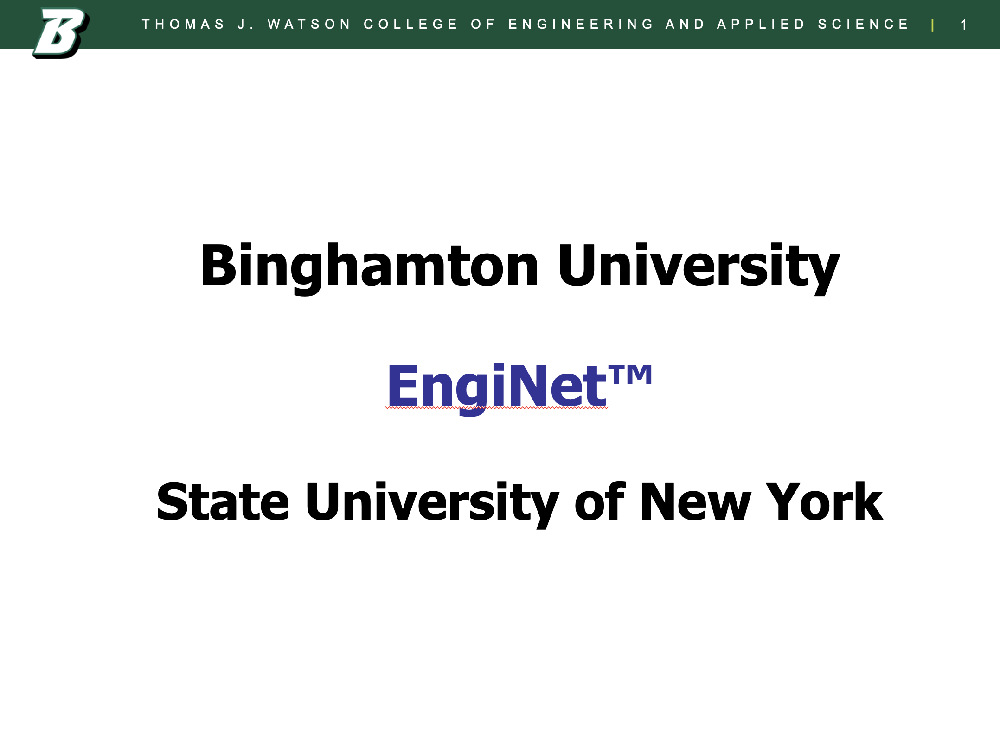
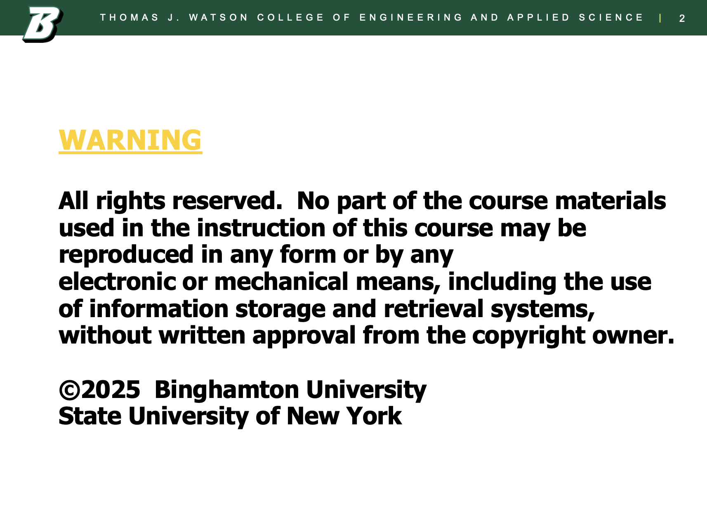

Check list
- [ ] Microphone turned on
- [ ] Zoom room open
- [ ] MyBinder launched
- [ ] Sound Volume on

---

# SSIE 419/519: Applied Soft Computing

Lecture 01: Introduction & Word Embeddings

Sadamori Kojaku

---

---

---

---

# Course Overview

- **Instructor:** Sadamori Kojaku (幸若完壮)
- **Email:** skojaku@binghamton.edu
- **Office Hours:** Tue & Thu 15:00-17:00
- **Lecture Note:** https://skojaku.github.io/applied-soft-comp
- **GitHub:** https://github.com/skojaku/applied-soft-comp

---

# Why Soft Computing?

---

---

---

---

# People that do not exist

[ThisPersonDoesNotExist.com](https://thispersondoesnotexist.com/)

---

---

# How is it possible?

---

# 60s-80s: Expert System

- Explicit rules
- Examples:
  - MYCIN (1976) for medical diagnosis
- Issues:
  - No adaptability
  - Need a lot of rules for complex tasks

---

# 90s-2000s: Statistical Learning

- Allow some randomness in real-world data
- Examples:
  - Support Vector Machine
  - Random Forest
- Issues:
  - Need a lot of data
  - No cross-domain generalization

---

# 2010s-2020s: Deep Learning 🧠

- Learn patterns from examples
- Adapt to new situations
- No need for explicit rules
- Handle complexity naturally

---

# Neural networks are not new

- Warren McCulloch and Walter Pitts to develop the concept of the McCulloch-Pitts (MCP) neuron in 1943.
- Frank Rosenblatt later introduced the perceptron learning rule for the MCP.

---

<iframe width="560" height="315" src="https://www.youtube.com/embed/cNxadbrN_aI?si=dji-pXYux8ibuVYM" title="YouTube video player" frameborder="0" allow="accelerometer; autoplay; clipboard-write; encrypted-media; gyroscope; picture-in-picture; web-share" referrerpolicy="strict-origin-when-cross-origin" allowfullscreen></iframe>

---

## Neural networks were virtually dead until 2012

- Computing limitations - computers were too slow to train meaningful neural networks
- Data scarcity - Neural networks require massive datasets that weren't available
- Vanishing gradient - Prevented training deep architectures effectively
- Better alternatives (e.g., SVMs) outperformed neural networks with less overhead
- AlexNet (2012) represents a breakthrough in deep learning

---

# Language Understanding: ChatGPT 💭

- Natural conversation abilities
- Multiple capabilities:
  - Poetry and creative writing
  - Technical explanations
  - Code assistance
  - Understanding context and humor

---

# Scientific Breakthrough: AlphaFold 🧬

- Solved 50-year protein folding problem
- Near-perfect accuracy
- Accomplished in days what took months in labs
- Revolutionary impact on biology and medicine

---

# Game AI: The Divine Move 🎮

- AlphaGo vs Lee Sedol
- Famous "Move 37"
- Demonstrated creative thinking
- Showed AI can surpass human intuition

---

# Video Generation: Sora 🎬

- Text-to-video technology
- 60-second realistic videos
- Physics-accurate scenes
- Multiple moving elements
- Photorealistic quality

---

# Medical Diagnosis: AI Assistant 👨‍⚕️

- Surpasses human accuracy in cancer detection
- Reduces:
  - Missed cases
  - False alarms
- Augments doctor's capabilities

---

# Autonomous Systems: Self-Driving 🚗

- Real-time sensor processing
- Faster than human reactions
- Constant alertness
- Improved safety in many conditions

---

# Why This Matters 🌟

- Unprecedented pace of breakthroughs
- Solving decades-old problems
- Surpassing human capabilities
- Transforming multiple fields:
  - Healthcare
  - Transportation
  - Scientific research
  - Creative arts

**Join the revolution in applied soft computing!**

---

# About this course

---

# Course Structure

"Don't think! Feeeeeel" - Bruce Lee

- 🎓 Lectures
- 🛠️ Hands-on exercises
- 📝 Weekly quizzes
- 💻 Biweekly coding assignments
- 🎓 Final project
- 📝 Exam

---

# Final Project 🎓

- Individual project (30% of grade) 📊
- Timeline 📅
  - 03/09: Project Proposal
  - 05/06: Project Presentation
  - 05/09: Project Final Paper
- Requirements 📋
  - Apply concepts to real problem 🌍
  - Show course integration 🧠
  - Clear presentation 🗣️

---

# Exam

- 📚 Final exam on all topics (weight: 30%)
- 📅 During exam week
- 📝 Theory + practical problems
- 🌍 Apply concepts to real scenarios
- 📚 Review sessions before exam

---

# Weekly Quiz on Brightspace

- 📊 Quizzes: A tool to identify misconceptions (weight: 20%)
- 🧠 Covers previous week's topics
- 🏁 Deadline: before final exam
- 🔄 Unlimited attempts until correct

---

# Assignment

- 📅 One assignment per module (weight: 20%)
- 💻 Coding exercises
- 🤖 Autograded assignments
- 🏁 Deadline: before final exam
- 🔄 Unlimited attempts until correct

---

# Lecture note

- 📚 [Interactive Jupyter book](https://skojaku.github.io/applied-soft-comp)
- 💻 Run code directly on the page
  - ⏳ First-time loading may take 2-3 mins
- 🔄 Or download as Jupyter notebook
  - ☁️ Use on cloud (Google Colab, Kaggle) or locally
  - 📦 Install packages from `environment.yml` for local use
  - See [The course GitHub repo](https://github.com/skojaku/applied-soft-comp/) for details
- Slides: [The course GitHub repo](https://github.com/skojaku/applied-soft-comp/slides)

---

# Policy

- 📚 3-credit course: 6.5+ hours of work/week outside class
- 🤖 AI tools allowed for learning, but cite if used in assignments
- 💾 Back up all data and code (loss not an excuse for late work)
- ♿ Accommodations available for students with disabilities
- 🚫 Zero tolerance for academic dishonesty

---

# Questions?

---

# Teaching computers how to understand words

---

---

# The Challenge: Teaching Computers Language 🧮

- Computers only understand numbers
- Words need to be translated into numerical form
- Early approach: One-hot encoding
  - Each word gets a unique binary vector
  - Example: cat → [1,0,0], dog → [0,1,0]
- Problem: No semantic meaning captured

---

# Distributional Hypothesis

Words that appear in similar contexts have similar meanings

---

# A trivia
- Ancient Buddhist concept of Apoha (5th-6th century CE):
  - We understand concepts by what they are not
  - Example: A "cow" is defined by everything that is not a cow
- Parallels with modern distributional semantics:
  - Both define meaning through relationships between concepts
  - Words understood by their contrasts with other words

---

# Another trivia

My grandma called me in many different ways
- Sadamori
- My son
- My nephew
- My niece
- My cousin
- Her dog

---

# How can we build such a distributional representation?
[Pen and Paper exercise](https://skojaku.github.io/applied-soft-comp/_downloads/7bc97d4364d978c1c47c7dfcd0576fe4/pen-and-paper.pdf)

---

# From Words to Numbers: TF-IDF 📊

- Term Frequency (TF):

  $$
  TF(t,d) = \frac{\text{count of term t in doc d}}{\text{total terms in doc d}}
  $$

- Inverse Document Frequency (IDF):

  $$
  IDF(t) = \log\frac{\text{total documents}}{\text{docs containing t}}
  $$

- Combined score:

  $$
  TF\text{-}IDF(t,d) = TF(t,d) \times IDF(t)
  $$

---

# The Distributional Hypothesis 🌐

                "You shall know a word by the company it keeps"
            ~Words appearing in similar contexts have similar meanings~

---

## Word2Vec: Neural Word Embeddings 🧠

Two approaches: CBOW (Continuous Bag of Words) and Skip-gram
1. CBOW: Predict center word from context
2. Skip-gram: Predict context from center word

---

# Model (Skip-gram)

$$
P(w_o|w_c) = \frac{\exp(v_{w_o}^T v_{w_c})}{\sum_{w \in V} \exp(v_w^T v_{w_c})}
$$

Where:
- $v_{w_c}$ is center word vector
- $v_{w_o}$ is output word vector
- $V$ is vocabulary

---

# Model (CBOW)

$$
P(w_c|w_1,...,w_C) = \dfrac{\exp(v_{w_c}^T \bar{v})}{\sum_{w \in V} \exp(v_w^T \bar{v})},
$$

where $\bar{v} = \dfrac{1}{C}\sum_{i=1}^C v_{w_i}$ is the average of the context word vectors.

---

# Matrix Factorization Connection 🔢

Word2vec implicitly factorizes a Pointwise Mutual Information (PMI) matrix:

$$
M_{ij} = \log \dfrac{P(w_i,  w_j)}{P(w_j)P(w_j)}
$$

Properties:
- Low when words appear independently
- High when words co-occur frequently
- Similar effect to TF-IDF normalization

Word embeddings preserve PMI values:

$$
v_{w_i} ^\top v_{w_j} \approx M_{ij}
$$

Key insight: Words that frequently appear in similar contexts will have similar embeddings!

---

# GloVe: Global Vectors 🌐

GloVe explicitly factorizes PMI matrix:

$$
M_{ij} = \log \frac{P(w_i, w_j)}{P(w_i)P(w_j)}
$$

---

# FastText: Handling Subwords 🔄

- Use subword information
- Example: "where" → "<wh", "whe", "her", "ere", "re>"
- Handles out-of-vocabulary words
- Better for morphologically rich languages

---

## Let's build the first word embedding using TF-IDF and word2vec

[Jupyter notebook](https://github.com/skojaku/applied-soft-comp/blob/master/notebooks/word-embedding.ipynb)

---

# SemAxis: Understanding Word Relationships 📐

- Identify two semantically interpretable clusters
- SemAxis: An axis between the cluster centroids, e.g., good-bad, soft-hard
- Project word vectors onto the SemAxis

---

# Bias in Word Embeddings ⚖️

Gender bias example:
- man : doctor :: woman : nurse
- he : programmer :: she : homemaker

---

# Let's build SemAxis

[Jupyter notebook](https://github.com/skojaku/applied-soft-comp/blob/master/notebooks/semaxis.ipynb)

---

# Doc2Vec: From Words to Documents 📄

Two models:
1. PV-DM (Distributed Memory)
2. PV-DBOW (Distributed Bag of Words)

---

# Doc2Vec (PV-DM)

PV-DM probability:

$$
P(w_i|w_{i-k},...,w_{i-1},d) = \frac{\exp(u_{w_i}^T h)}{\sum_{w \in V} \exp(u_w^T h)}
$$

Where $h$ is either:
- Average: $h = \frac{1}{k+1}(v_d + \sum_{j=i-k}^{i-1}v_{w_j})$
- Concatenation: $h = (v_d, \sum_{j=i-k}^{i-1}v_{w_j})U$

---

# Doc2Vec (PV-DBOW)

PV-DBOW probability:

$$
P(w_i|d) = \frac{\exp(u_{w_i}^T v_d)}{\sum_{w \in V} \exp(u_w^T v_d)}
$$

Where $v_d$ is the document vector.

---

# Let's build Doc2Vec

[Jupyter notebook](https://github.com/skojaku/applied-soft-comp/blob/master/notebooks/doc2vec.ipynb)

---

# Summary: Evolution of Word Embeddings 🎓

1. One-hot encoding → No semantics
2. TF-IDF → Document-level patterns
3. Word2Vec → Local context patterns
4. GloVe → Global patterns
5. FastText → Subword information
6. Doc2Vec → Document embeddings

---

# Applications and Future Directions 💡

- Machine Translation
- Document Classification
- Information Retrieval
- Sentiment Analysis
- Question Answering
- Text Generation
